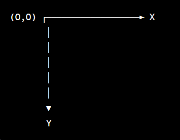

# Web's Coordinate System

The coordinate system used on the web is typically a two-dimensional Cartesian coordinate system.

## 1. Cartesian Coordinate System:
- This system uses two axes – horizontal (X-axis) and vertical (Y-axis).
- The point where the X and Y axes intersect is called the origin (0, 0).
- Each point on the plane is defined by an ordered pair (X, Y), where X is the horizontal distance and Y is the vertical distance.

## 2. Web Coordinate System:

- On the web, the coordinate system starts at the top-left corner of the browser or container element.
- The X-axis extends horizontally to the right, and the Y-axis extends vertically downwards.
- So, as you move to the right along the X-axis, the values increase, and as you move down the Y-axis, the values increase.

Here's a simple illustration:

- Origin (0,0): This is at the top-left corner of the container.
- X-axis (horizontal): Positive values extend to the right from the origin, and negative values extend to the left.
- Y-axis (vertical): Positive values extend downward from the origin, and negative values extend upward.

So, when you set a positive value for the top property in CSS or manipulate the style.top using JavaScript, you're saying "move this element down from the top of its container." It's following the natural positive direction of the y-axis, which is downward.

Conversely, when you set a negative value for top, you're saying "move this element up from the top of its container." This is against the positive direction of the y-axis, hence it moves upward.
