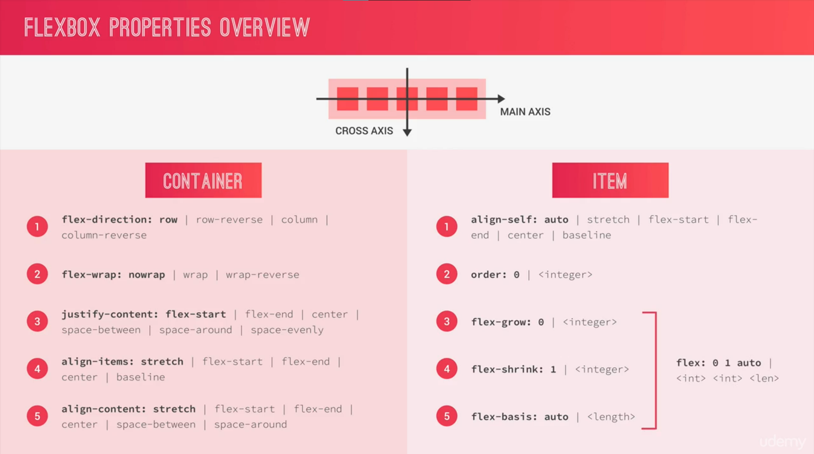

# Flexbox

## What is flexbox


## Flexbox terminology


## Flexbox cheatsheet


- ```flex-grow```:
  - This property determines how much a flex item should grow relative to the rest of the items in the flex container.
  - If all items have flex-grow set to 1, they will share the available space equally.
  - Higher values mean a greater share of the available space.

- ```flex-shrink```:
  - Conversely, flex-shrink determines how much a flex item should shrink if the container is too small.
  - A value of 0 means the item won't shrink. A higher value means it can shrink more.
  - This helps to prevent items from becoming too small when there's not enough space.

- ```flex-basis```:
  - This property sets the initial size of a flex item before any available space is distributed.
  - It can be a length (like pixels or percentage) or the keyword auto, which means the size is determined by the item's content.
  - It establishes the base size of the item in the ```main axis``` **(width)**.
 


The ```baseline``` value for ```align-items``` and ```align-self``` aligns items such that their baselines align with each other. The baseline is an imaginary line on which text and inline elements sit.

- ```align-items: baseline```:
  - Applied to the flex container.
  - Aligns items within the container based on their baselines.
  - Useful when dealing with text or inline elements of varying heights.
  - Ensures a visually harmonious layout where text appears aligned along their baseline.
 
- ```align-self: baseline```:
  - Applied to individual flex items within the container.
  - Overrides the container's align-items property for that specific item.
  - Aligns the item based on its baseline, regardless of the alignment of other items in the container.
