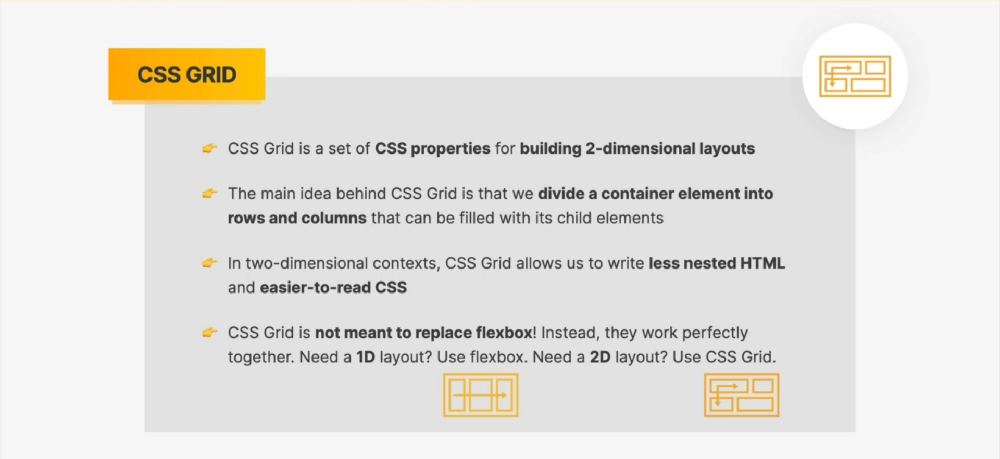
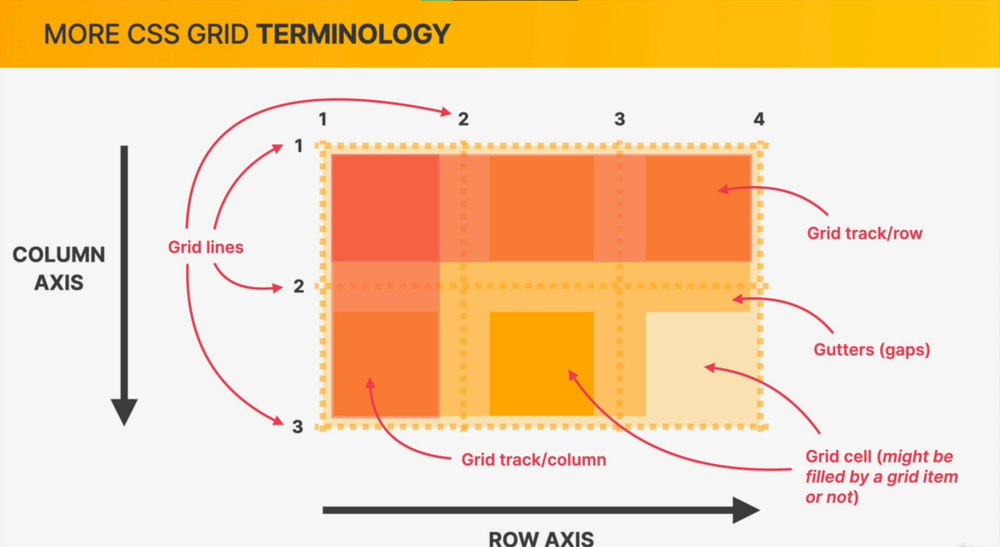
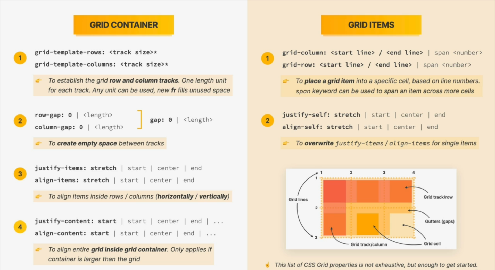

# CSS Grid

## What is grid



## Grid teminology




## Grid cheatsheet



- ```justify-cotent``` and ```align-content``` are used to align tracks inside of the container **_(ONLY APPLIES IF CONTAINER IS LARGER THAN THE GRID ITSELF)_**.
  - justify is for the ```row-axis``` (horizontal)
  - align is for the ```column-axis``` (vertical)

EXAMPLE:
```css
justify-content: center;
align-content: center;
```


#

- ```justify-items``` and ```align-items``` are used to align items inside their cell.
  - justify is for the ```row-axis``` (horizontal)
  - align is for the ```column-axis``` (vertical)
  - Note: you can always override these declaration using ```justify-self``` and ```align-self``` properties which is used for **SINGLE GRID ITEMS** (use it for individual elements).
 
EXAMPLE:

```css
/* CENTER THE GRID */
justify-content: center;
align-content: center;

/* CENTER THE ITEMS (IN THEIR CELL) */
justify-items: center;
align-items: center;
```


