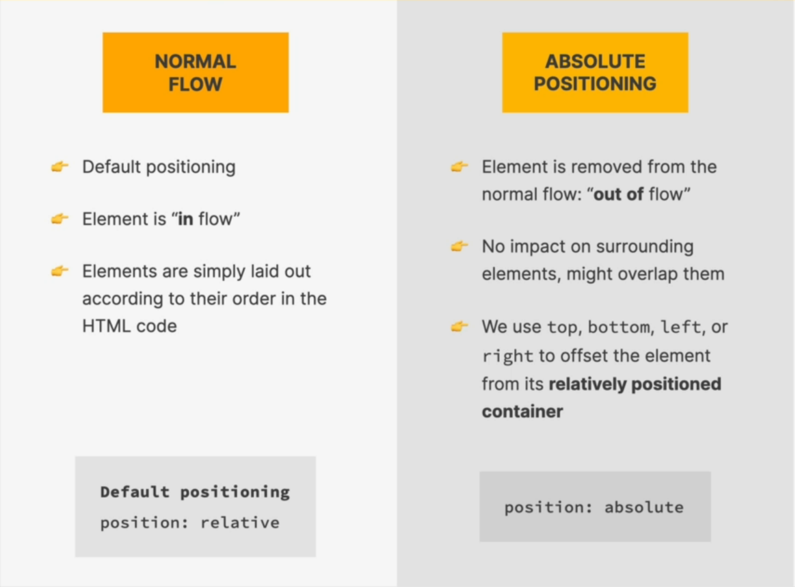

# Normal Flow vs Absolute Flow



If you set an element's position to: 

```html
body {
  <p>
Lorem ipsum dolor sit amet, consectetur adipiscing elit. Pellentesque eleifend semper metus, vel maximus leo egestas id. Phasellus at porta dui. Sed vehicula, magna eget venenatis ultricies, dolor nunc laoreet magna, at ullamcorper felis nibh quis nisl. Nullam volutpat sed neque at aliquet. Etiam et bibendum mauris. Sed blandit mi nec massa fermentum pharetra. Aenean mollis efficitur enim, at eleifend arcu porta quis. Nullam ut dui vulputate, mattis ante id, ultricies nulla. Donec fermentum libero id est laoreet, id elementum quam imperdiet. Nullam eget velit ut magna lacinia lobortis sit amet vel nisl. Vivamus ut mi faucibus neque sagittis rutrum.

Nulla facilisi. Pellentesque habitant morbi tristique senectus et netus et malesuada fames ac turpis egestas. In hac habitasse platea dictumst. Duis vitae velit id arcu maximus venenatis in sed enim. Nulla tristique ac mi vitae varius. Proin congue nunc nisi, in efficitur orci vestibulum sed. Aenean a scelerisque enim. Mauris sed nisl mollis, varius diam sed, feugiat lectus. Aliquam commodo diam ac sem dictum, a aliquam metus pellentesque. Maecenas lectus est, iaculis non porta volutpat, rhoncus vitae felis. Nulla convallis ligula eu vehicula dapibus. Quisque auctor nisl nunc, gravida condimentum lacus pellentesque quis.

Nunc pharetra porta viverra. Nulla at diam nec enim malesuada bibendum nec nec tellus. Suspendisse dictum nibh at augue dignissim iaculis. Donec porta elit nisi, id vulputate justo auctor at. Vestibulum at commodo eros, vel ullamcorper augue. Vivamus mauris purus, venenatis ac diam eu, interdum iaculis magna. Etiam dignissim, arcu nec scelerisque aliquam, nunc augue pharetra ex, vitae dignissim risus arcu pharetra arcu. Duis imperdiet interdum ipsum volutpat viverra. Sed ultrices, leo et pretium blandit, dui nunc ultricies ante, nec tincidunt dolor massa a sapien. Nam neque leo, dignissim in tempor et, pulvinar a felis.
  </p>
  <button>Click Me</button>
}
```

```css
button {
  position: aboslute;
  bottom: 50px;
  right: 50px;
}
```

The ```button``` element in this case will now be positioned in relation to the viewport because by default, the position property for all HTML elements in CSS is set to static . This means that if you don't specify any other position value or if the position property is not declared explicitly, it'll be static. Usually, we don't want this to be the case. We want to absolutely position the element in relation to some other parent container/element. In order to do that, we need to specifically set the position of the parent element to ```relative```.

```css
body {
  position: relative;
}

button {
  position: absolute;
  bottom: 50px;
  right: 50px;
}
```

Here's a graphical illustration of this:


